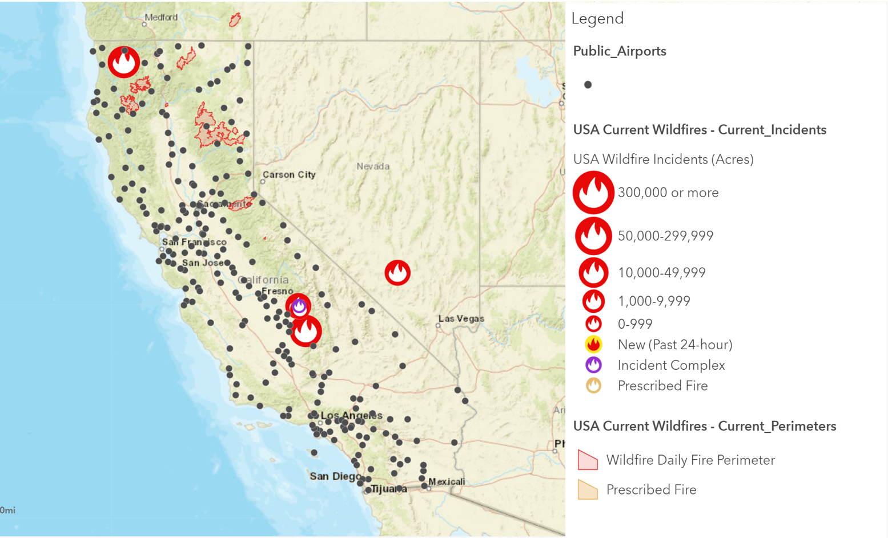

## Portfolio

---

### Grad School Projects and Professional Work

[Analysis of the Existing Electric Vehicle Infrastructure in the DFW Metroplex](/pdf/JMammen_GIS5253-999_FinalProject.pdf)

---
[A Spatial Analysis of Wind Turbines across the United States](/sample_page)

---
[GIS within my current Profession](/images/Road_Closures.PNG)

---

### ArcGIS Online Map Example

### Undergrad Capstone Project

---

---

Page template forked from <a href="https://github.com/evanca/quick-portfolio">evanca</a>

<!-- Remove above link if you don't want to attibute -->
